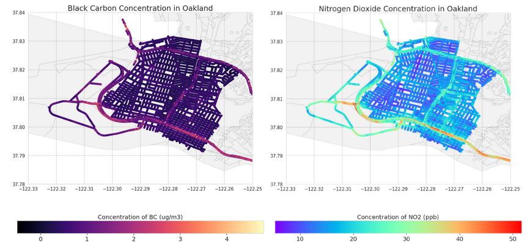

# Hyperlocal Air Quality Prediction in East Bay Area, CA 
## Building a Machine Learning Model for Air Quality Predictions

  

This is the repository for my Capstone Project 1 for the Springboard Data Science Program. The project is titled "**Air Quality Prediction in East Bay Area, CA - Building a Machine Learning Model for Air Quality Predictions**". The goal of this project is to build machine learning models to predict air quality per city-block in the City of Oakland and San Leandro based on previously measured pollutant concentrations, local meteorological conditions, and local sources of emissions such as industries, traffic intersection data, and automobile traffic on highways without having to rely on complex physical modeling.

The following files and folders are included in this repository: 

**Final Report and Slides:**
1) [Final Report](https://docs.google.com/document/d/1O4EVbfy25cbHRh-oj5EiFordC1YzO6AiKUTk2HrFMdk/edit?usp=sharing)
2) [Slide Deck](https://docs.google.com/presentation/d/1bp7oKs9OSkd6tRHPIkXlks3w1ckTvMdcWbapUzMmYgA/edit?usp=sharing)

**Progress Reports:** 
1) [Project Proposal](https://docs.google.com/document/d/1DZSjTnbRphXPJafBAojMb5ssY3CB8ZgSLfkbO-fq0PE/edit?usp=sharing)
2) [Data Wrangling](https://docs.google.com/document/d/1wLtKCeIKO7yS-KDx5xGJ1yALkgufEYSeBW4VhX9HfTg/edit?usp=sharing)
3) [Data Story](https://docs.google.com/document/d/12WRhB1JagqRohJwLGzm3qGDXJj00ir3Qwgq7gAuCgPM/edit?usp=sharing)
4) [Statistical Data Analysis](https://docs.google.com/document/d/1Hn2juZBQksRuiOtAw1l3X4K9MLVCJGDJbqpDMaKffUY/edit?usp=sharing)
5) [Milestone Report](https://docs.google.com/document/d/18KJ42Hjgo9us4pPHvghYumkCoYwc9l4h4hawx9tFffc/edit?usp=sharing)
6) [Machine Learning Report](https://docs.google.com/document/d/1-_KyquDvB8UGTj6j_ZitGgwAEORHSwSFh0wjOft1uJA/edit?usp=sharing)

**Jupyter Notebooks:**
1) [Data Cleaning - National Emissions Inventory Data](https://github.com/varsha2509/Springboard-DS/blob/master/Capstone1/Capstone1/Data-Cleaning-NEI-Data.ipynb)
2) [Daymet Data - API Call](https://github.com/varsha2509/Springboard-DS/blob/master/Capstone1/Capstone1/Daymet-Data-API-Call.ipynb)
3) [Traffic Data - Open Street Maps](https://github.com/varsha2509/Springboard-DS/blob/master/Capstone1/Capstone1/OSM-Traffic-Data.ipynb)
4) [Distance to Facilities](https://github.com/varsha2509/Springboard-DS/blob/master/Capstone1/Capstone1/Calculate-Distance-To-All-Facilities.ipynb)
5) [Exploratory Data Analysis](https://github.com/varsha2509/Springboard-DS/blob/master/Capstone1/Capstone1/Exploratory-Data-Analysis.ipynb) 
6) [Statistical Data Analysis and Machine Learning](https://github.com/varsha2509/Springboard-DS/blob/master/Capstone1/Capstone1/Statistical-Data-Analysis-And-Machine-Learning-All-Facilities.ipynb)
7) [Visualizations](https://github.com/varsha2509/Springboard-DS/blob/master/Capstone1/Capstone1/Visualizations.ipynb)
